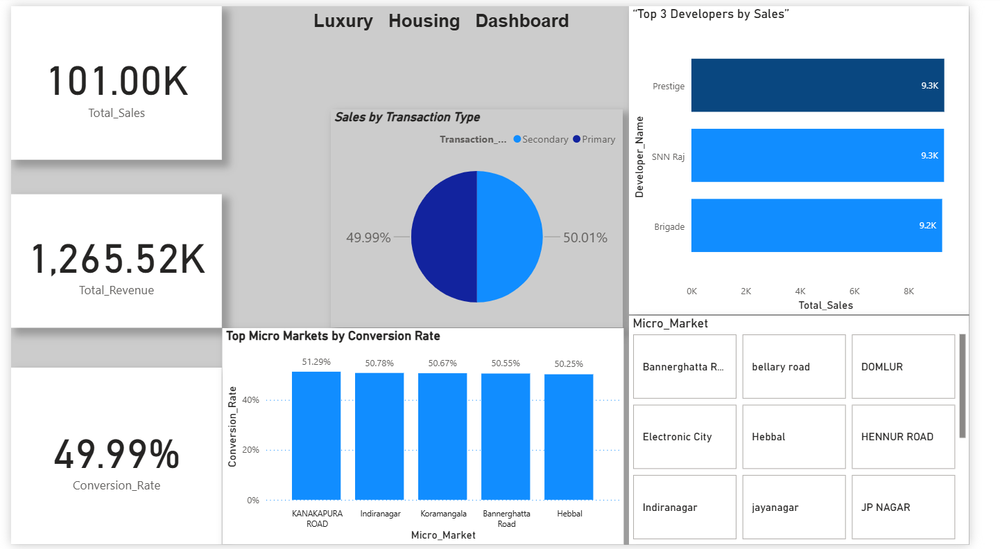
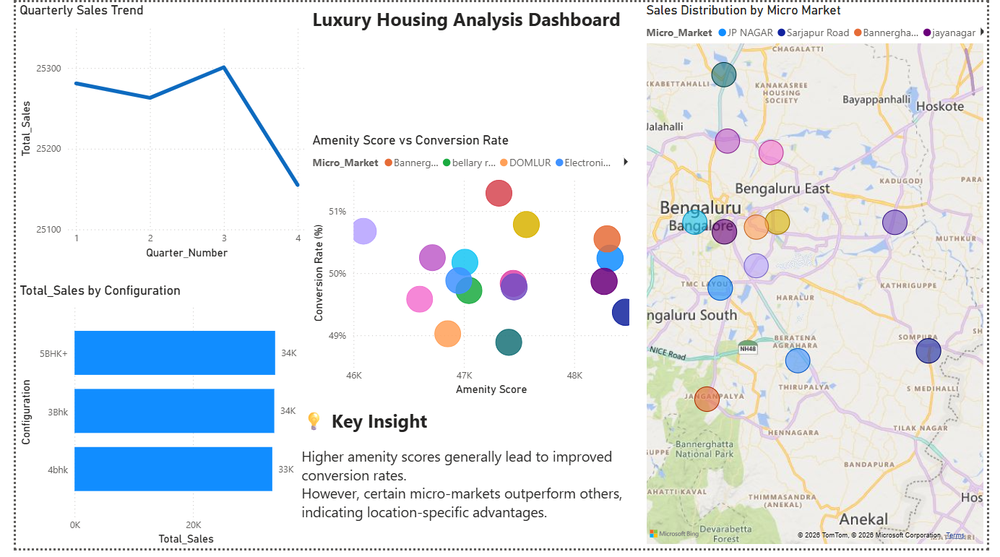

# 🏡 Luxury Housing Data Analysis

## 📌 Project Overview

This project analyzes luxury housing data to uncover trends in sales, conversion rates, and market performance across different micro-markets.

---

## 🛠 Tools Used

* Python (Data Cleaning)
* SQL (Data Analysis)
* Power BI (Data Visualization)

---

## 📊 Dashboard Overview

### 🔹 Page 1: Overview Dashboard

* Total Sales, Revenue, Conversion Rate
* Sales by Transaction Type
* Top Developers
* Micro Market Analysis

### 🔹 Page 2: Analysis Dashboard

* Quarterly Sales Trend
* Amenity Score vs Conversion Rate
* Sales by Configuration
* Geographic Sales Distribution (Map)

---

## 💡 Key Insights

* Higher amenity scores improve conversion rates
* Certain locations outperform others due to demand
* Sales are concentrated in key micro-markets
* Larger configurations generate higher sales

---

## 📸 Dashboard Preview

### Overview Dashboard

### Analysis Dashboard

---

## 🎯 Conclusion

This project demonstrates how data-driven insights can improve real estate decision-making using Python, SQL, and Power BI.
